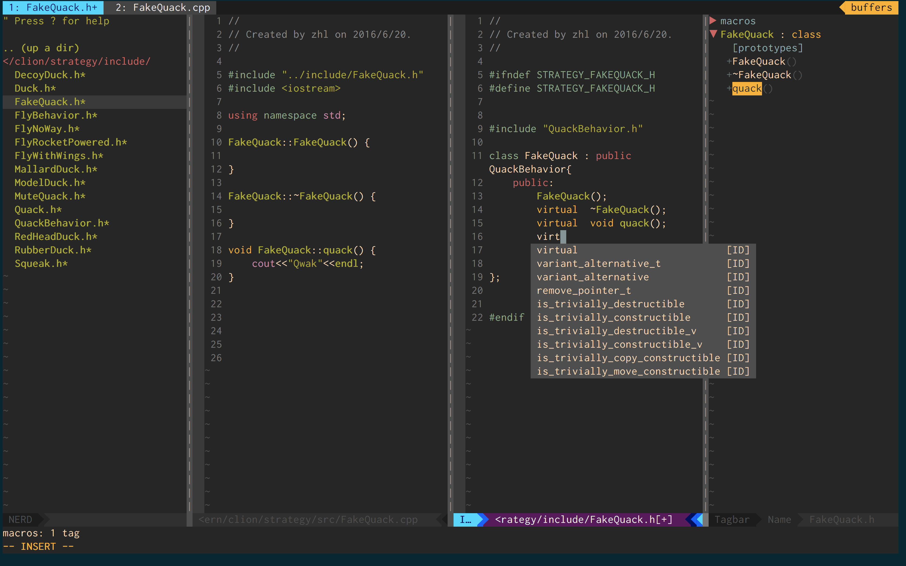

## Using Vim As IDE


### Dependent libs
    ``` bash
    git ctags python ruby clang astyle
    ```
### Install Vim from source
    It is recommended that utilizing brew to install vim under macOS:
    ```
    brew install vim --with-override-system-vi --with-python --with-lua --with-perl --with-ruby
    ```
    While in Linux system, you might refer the following instruction:
    ``` bash
    sudo yum install python-devel python3-devel ruby-devel libX11-devel gtk-devel gtk2-devel gtk3-devel ncurses-devel
    ./configure --with-features=huge --enable-pythoninterp --enable-python3interp --enable-gui=gtk2 --enable-cscope --prefix=/usr --enable-luainterp --with-vim-name=vi
    ```

### Download the vimrc from github
    ```
    git clone https://github.com/demon0612/vimrc.git
    sh vimrc/install.sh
    ```

### Plugin List

    | Name | Usage | Plugin |
    | :------------------------: | :---------------------: | :----------------------: |
    |Vundle|Manager plugins|gmarik/Vundle.vim|
    |vim-colorschemes|Collection of colorshemes|flazz/vim-colorshemes|
    |vim-airline| Lean & mean status/tabline for vim that's light as air|bling/vim-airline|
    |vim-airline-themes|The official theme repository for vim-airline|vim-airline/vim-airline-themes|
    |vim-cpp-enhanced-highlight|additional vim c++ syntax highlighting|octol/vim-cpp-enhanced-highlight|
    |nerdtree|The NERD tree allows to explore filesystem and to open files and directories| scrooloose/nerdtree|
    |nerdtree-git-plugin|A plugin of NERDTree showing git status flags|Xuyuanp/nerdtree-git-plugin|
    |vim-nerdtree-tabs|NERDTree and tabs together in Vim, painlessly|jistr/vim-nerdtree-tabs|
    |vim-misc|Libs for easytags|xolox/vim-misc|
    |vim-easytags|Automated tag generatiron|xolox/vim-easytags|
    |tagbar|A plugin reads your tags file and displays the information in an accesible way inside vim|majutsushi/tagbar|
    |a|Switch between source files and header files quickly|vim-scripts/a.vim|
    |delimitMate|A smart plugin to insert matching delimiters, like quotes,parentheses,and curly braches|Raimondi/delimitMate|
    |nerdcommenter|Vim plugin for intensely orgasmic commenting|scrooloose/nerdcommenter|
    |ack.vim|Libs for ctrlsf.vim|mileszs/ack.vim|
    |ctrlsf.vim|A ack/ag powered code serach and view tool|dyng/ctrlsf.vim|
    |vim-multiple-cursors|True sublime test style multiple selections for vim|terryma/vim-multiple-cursors|
    |vim-snippets|Collections of snippets|honza/vim-snippets|
    |ultisnips|UltiSnips is the ultimate solution for snippets in Vim|SirVer/ultisnips|
    |bufexplorer|bufexplorer can quickly and easily switch between buffers|jlanzarotta/bufexplorer|
    |vim-autoformat|provide easy code formatting in vim|Chiel92/vim-autoformat|
    |YouCompleteMe|A code-completion engine for Vim|Valloric/YouCompleteMe|

### Plugin ShortCut

    | Name | ShortCut | Meaning|
    | :------------------------: | :---------------------: | :---------------------: |
    | vim-nerdtree-tabs| **< F3 > **|toggle nerdtree tabs|
    | vim-nerdtree-tabs|open window |**o**=open **i**=vertle split **s**=horizontal split **u**=jump to top level|
    | tagbar| **< F4 >** |toggle tarbar|
    | tagbar| open window |press**< CR >** to tag definition |
    | a |**< F2 >**|switch files|
    |nerdcommenter|**< leader > cc**|comment one line|
    |nerdcommenter|**< leader > c < space >**|comment toggle|
    |nerdcommenter|**< leader > cm**|comment one block|
    |nerdcommenter|**< leader > cu**|uncomment one line/block|
    |ctrlsf.vim|**< leader > ff**|CtrlSF|
    |ctrlsf.vim|**< leader > fn**|Using the word under cursor as CtrlSF parameter|
    |Ctrlsf.vim| open window|**< CR >** to open cursor in new buffer|
    |Ctrlsf.vim| open window|**t** to open cursor in new tab|
    |Ctrlsf.vim| open window|**p** to open cursor in new previous window|
    |Ctrlsf.vim| open window|**q** to quit previous window
    |Ctrlsf.vim| open window|**< C-j >< C-k >** move to previous/next cursor|
    |vim-multiple-cursors|**< F5 >** |Start multi cursor|
    |vim-multiple-cursors|**< C-j >< C-K >**|Multi cursor next/previous key|
    |vim-multiple-cursors|**< C-p>**|Multi cursor skip key|
    |ultisnips|**< tab >**|expand trigger|
    |ultisnips|**< tab >**|forward trigger|
    |ultisnips|**< C-tab >**|Backward trigger|
    |bufexplorer|**< F6 >**|Open BufExplorer|
    |vim-autoformat|**< F7 >**|AutoFormat|
    |YouCompleteMe|**< leader >dc** |Go to declaration |
    |YouCompleteMe|**< leader >dc** |Go to definition |
    |YouCompleteMe|**< leader >dg** | Go to definition else declaration|
    |YouCompleteMe|**< C-j > or < Down >**| Move to next item|
    |YouCompleteMe|**< C-k > or < Up >**| Move to previous item|

